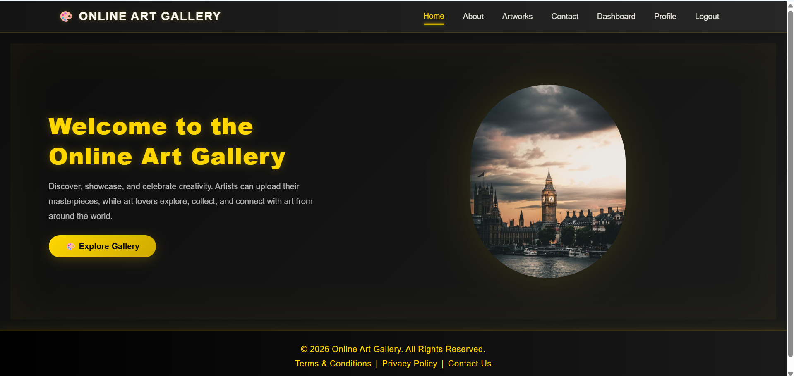
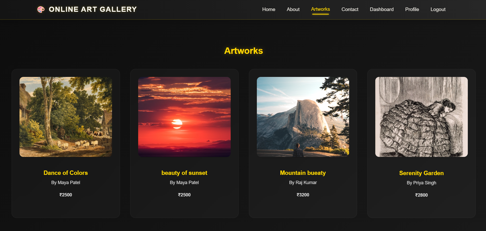

<p align="center">
  
</p>

<h1 align="center">🎨 Online Art Gallery — Frontend</h1>

<p align="center">React (Vite) frontend for the Online Art Gallery platform</p>

---

## 🔗 Full Project Repository

👉 https://github.com/shaikreshmashaik2007-afk/FSAD_ONLINE_ART_GALLERY_FRONTEND_AND_BACKEND.git

---

<p align="center">
  
  
  
  
</p>

---

## 🌐 Live Demo

* **Frontend (Vercel):** 👉 https://online-art-gallery-frontend.vercel.app/

---

## 🧰 Tech Stack

| Layer             | Technology        |
| ----------------- | ----------------- |
| **Framework**     | React (Vite)      |
| **HTTP Client**   | Axios             |
| **Routing**       | React Router DOM  |
| **Notifications** | React Toastify    |
| **Payment**       | Razorpay (JS SDK) |
| **Deployment**    | Vercel            |

---

## ✨ Features

* 👤 **User Signup / Login with JWT Authentication**
* 🖼 **Browse Artworks** — explore the full gallery
* 🔒 **Protected Routes** — must be logged in to view or buy artwork
* 🛒 **Buy Now** — secure payments via Razorpay
* 👨‍💼 **Admin Panel** — add, edit, and delete artworks
* 📱 **Fully Responsive UI**

---

## 🖼️ Screenshots

### Home Page

> 

### Artworks Page

> 

---

## ⚡ Local Setup

### Prerequisites

* Node.js v18+
* npm or yarn

### Steps

```bash
# 1. Clone the repository
git clone https://github.com/shaikreshmashaik2007-afk/Online-Art-Gallery-Frontend.git

# 2. Navigate to project
cd Online-Art-Gallery-Frontend

# 3. Install dependencies
npm install

# 4. Create a .env file
cp .env.example .env

# 5. Start the dev server
npm run dev
```

---

## 📁 Project Structure

```
OnlineArtGallery-Frontend/
├── public/
│   ├── home.png
│   └── Artworks.png
├── src/
│   ├── components/
│   ├── pages/
│   ├── services/
│   ├── context/
│   ├── App.jsx
│   └── main.jsx
├── .env
├── package.json
└── vite.config.js
```

---

## 🚀 Deploying to Vercel

1. Push your code to GitHub
2. Go to https://vercel.com → **New Project**
3. Import your repo
4. Set **Root Directory** to `OnlineArtGallery-Frontend`
5. Deploy ✅
